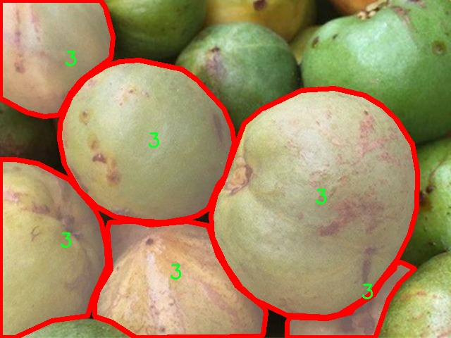

# 番石榴果实分级图像分割系统： yolov8-seg-bifpn

### 1.研究背景与意义

[参考博客](https://gitee.com/YOLOv8_YOLOv11_Segmentation_Studio/projects)

[博客来源](https://kdocs.cn/l/cszuIiCKVNis)

研究背景与意义

随着全球经济的发展和人们生活水平的提高，水果的消费需求日益增长，尤其是对高品质水果的追求愈发明显。番石榴作为一种营养丰富、口感独特的水果，受到越来越多消费者的青睐。然而，番石榴的种植和销售过程中，果实的分级与质量控制仍然面临诸多挑战。传统的人工分级方法不仅耗时耗力，而且容易受到主观因素的影响，导致分级结果的不一致性和不准确性。因此，基于计算机视觉和深度学习技术的自动化分级系统的研究与应用显得尤为重要。

近年来，深度学习在图像处理领域取得了显著的进展，尤其是目标检测和图像分割技术的发展，为水果分级提供了新的解决方案。YOLO（You Only Look Once）系列模型因其高效的实时检测能力而广泛应用于各类图像识别任务。YOLOv8作为该系列的最新版本，结合了更先进的网络结构和算法优化，具备了更强的特征提取和处理能力。因此，基于改进YOLOv8的番石榴果实分级图像分割系统的研究，能够有效提升果实分级的自动化程度和准确性。

本研究将利用一个包含1500张图像的番石榴数据集，该数据集经过精细标注，涵盖了四个不同的分级类别。通过对这些图像进行实例分割，可以实现对每个果实的精确定位和分类，从而为后续的自动化分级提供坚实的基础。具体而言，数据集中每个类别的样本数量和特征差异，将为模型的训练和评估提供丰富的多样性，增强模型的泛化能力和适应性。

此外，基于改进YOLOv8的图像分割系统，不仅可以提高番石榴的分级效率，还能在实际应用中减少人为误差，提升分级的标准化程度。这一系统的成功实现，将为果农、经销商和消费者提供更为可靠的质量保障，促进番石榴产业的可持续发展。同时，该研究的成果也将为其他水果的自动化分级提供借鉴，推动农业智能化的发展。

综上所述，基于改进YOLOv8的番石榴果实分级图像分割系统的研究，不仅具有重要的理论意义，也具备广泛的应用前景。通过将先进的深度学习技术与农业生产相结合，能够有效提升番石榴的市场竞争力，推动农业现代化进程，为实现农业高质量发展贡献力量。

### 2.图片演示


注意：本项目提供完整的训练源码数据集和训练教程,由于此博客编辑较早,暂不提供权重文件（best.pt）,需要按照6.训练教程进行训练后实现上图效果。

### 3.视频演示

[3.1 视频演示](https://www.bilibili.com/video/BV1QsmeY6EQ9/)

### 4.数据集信息

##### 4.1 数据集类别数＆类别名

nc: 3
names: ['0', '1', '3']


##### 4.2 数据集信息简介

数据集信息展示

在现代计算机视觉领域，图像分割技术的进步为水果分级、质量检测等应用提供了强有力的支持。为此，我们构建了一个专门用于训练改进YOLOv8-seg的番石榴果实分级图像分割系统的数据集，命名为“Guava Annotation”。该数据集的设计旨在为研究人员和开发者提供高质量的标注数据，以便于在实际应用中实现更为精准的果实分级。

“Guava Annotation”数据集包含了三种不同的类别，分别标记为‘0’，‘1’和‘3’，这些类别代表了番石榴果实在分级过程中所需识别的不同状态或质量等级。具体而言，类别‘0’可能代表未成熟的果实，类别‘1’则表示成熟的果实，而类别‘3’则可能指代过熟或腐烂的果实。这种分类方式不仅便于机器学习模型的训练，也为后续的果实质量评估提供了清晰的标准。

在数据集的构建过程中，我们精心挑选了大量的番石榴图像，确保每个类别的样本数量均衡且具有代表性。图像的采集涵盖了不同的生长环境、光照条件以及拍摄角度，以增强模型的泛化能力。通过对图像进行精确的标注，我们为每一张图像中的果实区域绘制了细致的分割轮廓，这为YOLOv8-seg模型的训练提供了坚实的基础。

此外，数据集还考虑到了实际应用中的多样性。为了提高模型在不同场景下的适应性，我们引入了不同背景的图像，例如农田、市场和实验室等场景。这种多样性不仅提升了模型的鲁棒性，也使得其在实际应用中能够更好地应对不同的环境挑战。

在数据集的使用过程中，研究人员可以利用这些标注数据进行深度学习模型的训练与验证。通过使用“Guava Annotation”数据集，改进YOLOv8-seg模型能够学习到番石榴果实的特征，并在图像分割任务中实现高效的性能。该模型的最终目标是能够自动识别并分级番石榴果实，从而为农业生产提供智能化的解决方案，提升生产效率和果实质量。

综上所述，“Guava Annotation”数据集不仅为番石榴果实的图像分割提供了丰富的标注数据，也为改进YOLOv8-seg模型的训练奠定了坚实的基础。随着该数据集的不断优化和扩展，我们期待能够推动番石榴果实分级技术的进一步发展，为农业领域的智能化转型贡献力量。





### 5.项目依赖环境部署教程（零基础手把手教学）

[5.1 环境部署教程链接（零基础手把手教学）](https://www.bilibili.com/video/BV1jG4Ve4E9t/?vd_source=bc9aec86d164b67a7004b996143742dc)


[5.2 安装Python虚拟环境创建和依赖库安装视频教程链接（零基础手把手教学）](https://www.bilibili.com/video/BV1nA4VeYEze/?vd_source=bc9aec86d164b67a7004b996143742dc)

### 6.手把手YOLOV8-seg训练视频教程（零基础手把手教学）

[6.1 手把手YOLOV8-seg训练视频教程（零基础小白有手就能学会）](https://www.bilibili.com/video/BV1cA4VeYETe/?vd_source=bc9aec86d164b67a7004b996143742dc)


按照上面的训练视频教程链接加载项目提供的数据集，运行train.py即可开始训练



     Epoch   gpu_mem       box       obj       cls    labels  img_size
     1/200     0G   0.01576   0.01955  0.007536        22      1280: 100%|██████████| 849/849 [14:42<00:00,  1.04s/it]
               Class     Images     Labels          P          R     mAP@.5 mAP@.5:.95: 100%|██████████| 213/213 [01:14<00:00,  2.87it/s]
                 all       3395      17314      0.994      0.957      0.0957      0.0843

     Epoch   gpu_mem       box       obj       cls    labels  img_size
     2/200     0G   0.01578   0.01923  0.007006        22      1280: 100%|██████████| 849/849 [14:44<00:00,  1.04s/it]
               Class     Images     Labels          P          R     mAP@.5 mAP@.5:.95: 100%|██████████| 213/213 [01:12<00:00,  2.95it/s]
                 all       3395      17314      0.996      0.956      0.0957      0.0845

     Epoch   gpu_mem       box       obj       cls    labels  img_size
     3/200     0G   0.01561    0.0191  0.006895        27      1280: 100%|██████████| 849/849 [10:56<00:00,  1.29it/s]
               Class     Images     Labels          P          R     mAP@.5 mAP@.5:.95: 100%|███████   | 187/213 [00:52<00:00,  4.04it/s]
                 all       3395      17314      0.996      0.957      0.0957      0.0845


### 7.50+种全套YOLOV8-seg创新点加载调参实验视频教程（一键加载写好的改进模型的配置文件）

[7.1 50+种全套YOLOV8-seg创新点加载调参实验视频教程（一键加载写好的改进模型的配置文件）](https://www.bilibili.com/video/BV1Hw4VePEXv/?vd_source=bc9aec86d164b67a7004b996143742dc)

### YOLOV8-seg算法简介

原始YOLOv8-seg算法原理

YOLOv8-seg算法是2023年由Ultralytics公司推出的YOLO系列最新版本，标志着目标检测与图像分割领域的又一次技术飞跃。该算法在YOLOv8的基础上，结合了图像分割的需求，旨在实现高效、准确的目标检测与分割。YOLOv8-seg不仅继承了YOLO系列一贯的高速度和高精度特性，还通过创新的网络结构和优化策略，提升了在复杂场景下的表现。

首先，YOLOv8-seg的网络结构分为四个主要部分：输入端、主干网络、颈部网络和头部网络。输入端负责对输入图像进行预处理，包括数据增强、尺寸调整和自适应锚框计算等。为了提高模型的鲁棒性，YOLOv8-seg采用了马赛克（mosaic）数据增强技术，通过将多张图像拼接在一起，生成新的训练样本，从而丰富了训练数据的多样性。此外，自适应锚框计算机制使得模型能够根据输入图像的特征动态调整锚框的大小和形状，进一步提升了检测的准确性。

在主干网络部分，YOLOv8-seg采用了CSP（Cross Stage Partial）结构和C2f（Crossover Feature Fusion）模块。CSP结构通过将特征提取过程分为两个部分，分别进行卷积和连接，有效地增强了特征表示能力。而C2f模块则是YOLOv8-seg的核心创新之一，它借鉴了YOLOv7中的E-ELAN结构，通过跨层连接的方式，丰富了模型的梯度流，使得特征学习更加高效。C2f模块的设计理念在于，通过增加分支和连接，提升特征的多样性和表达能力，从而在目标检测和分割任务中取得更好的效果。

在主干网络的末尾，YOLOv8-seg引入了SPPF（Spatial Pyramid Pooling Fusion）模块，旨在通过多尺度特征的融合，增强模型对不同尺度目标的检测能力。SPPF模块利用多个最大池化层，对特征图进行处理，生成多尺度的特征表示，确保模型在面对不同大小的目标时，能够保持高效的检测性能。

颈部网络采用了PAN-FPN（Path Aggregation Network - Feature Pyramid Network）结构，这一设计旨在加强不同尺度特征的融合能力。PAN-FPN通过将高层特征与低层特征进行有效结合，确保了信息的充分传递，提升了模型对小目标和复杂背景的适应能力。这一特性对于图像分割任务尤为重要，因为分割任务通常需要对图像中的细节进行精确处理。

在头部网络部分，YOLOv8-seg采用了解耦的检测头结构，这一设计使得分类和回归过程能够独立进行，从而提高了模型的灵活性和准确性。具体而言，头部网络通过两个并行的卷积分支，分别计算目标的类别和位置。分类分支使用二元交叉熵损失（Binary Cross Entropy Loss）进行训练，而回归分支则结合了分布焦点损失（Distribution Focal Loss）和完全交并比损失（Complete Intersection over Union Loss），以提高边界框预测的精准性。这种解耦设计不仅提升了模型的性能，还加速了训练过程。

值得一提的是，YOLOv8-seg采用了Anchor-Free的检测方式，摒弃了传统的锚框预测机制，减少了计算复杂度。通过这种方式，YOLOv8-seg能够在进行目标检测时，显著降低非最大抑制（Non-Maximum Suppression, NMS）的计算量，从而提升了整体的检测速度。这一创新使得YOLOv8-seg在实时应用场景中表现得尤为出色，能够满足对速度和精度的双重需求。

在损失函数的设计上，YOLOv8-seg引入了Task-Aligned Assigner策略，以根据分类与回归的分数加权结果选择正样本。这一策略的引入，使得模型在训练过程中能够更好地平衡正负样本的分配，提升了模型的学习效率。此外，YOLOv8-seg在损失计算中，充分考虑了目标检测和分割的特性，确保了模型在不同任务中的适应性。

总的来说，YOLOv8-seg算法通过对YOLOv8的多项改进和创新，成功地将目标检测与图像分割相结合，形成了一种高效、灵活的解决方案。其独特的网络结构设计、先进的损失函数策略以及对不同尺度特征的有效融合，使得YOLOv8-seg在实际应用中表现出色，能够满足各类复杂场景下的需求。随着YOLOv8-seg的不断发展与完善，未来在智能监控、自动驾驶、医疗影像等领域的应用前景将更加广阔。


### 9.系统功能展示（检测对象为举例，实际内容以本项目数据集为准）

图9.1.系统支持检测结果表格显示

  图9.2.系统支持置信度和IOU阈值手动调节

  图9.3.系统支持自定义加载权重文件best.pt(需要你通过步骤5中训练获得)

  图9.4.系统支持摄像头实时识别

  图9.5.系统支持图片识别

  图9.6.系统支持视频识别

  图9.7.系统支持识别结果文件自动保存

  图9.8.系统支持Excel导出检测结果数据


### 10.50+种全套YOLOV8-seg创新点原理讲解（非科班也可以轻松写刊发刊，V11版本正在科研待更新）

#### 10.1 由于篇幅限制，每个创新点的具体原理讲解就不一一展开，具体见下列网址中的创新点对应子项目的技术原理博客网址【Blog】：


[10.1 50+种全套YOLOV8-seg创新点原理讲解链接](https://gitee.com/qunmasj/good)

#### 10.2 部分改进模块原理讲解(完整的改进原理见上图和技术博客链接)【如果此小节的图加载失败可以通过CSDN或者Github搜索该博客的标题访问原始博客，原始博客图片显示正常】
### YOLOv8简介
YOLO（You Only Look Once）是一种流行的对象检测和图像分割模型，由华盛顿大学的Joseph Redmon和Ali Farhadi开发。YOLO于2015年推出，以其高速度和高精度迅速走红。

YOLOv2于2016年发布，通过合并批处理规范化、锚盒和维度集群来改进原始模型
2018年推出的YOLOv3使用更高效的骨干网络、多个锚点和空间金字塔池进一步增强了该模型的性能
YOLOv4于2020年发布，引入了Mosaic数据增强、新的无锚检测头和新的丢失功能等创新
YOLOv5进一步提高了模型的性能，并添加了超参数优化、集成实验跟踪和自动导出到流行导出格式等新功能
YOLOv6于2022年由美团开源，目前正在该公司的许多自动配送机器人中使用
YOLOv7在COCO关键点数据集上添加了额外的任务，如姿态估计
YOLOv8是Ultralytics公司推出的YOLO的最新版本。作为一款尖端、最先进的（SOTA）车型，YOLOv8在之前版本的成功基础上，引入了新的功能和改进，以增强性能、灵活性和效率。YOLOv8支持全方位的视觉AI任务，包括检测、分割、姿态估计、跟踪和分类。这种多功能性允许用户在不同的应用程序和域中利用YOLOv8的功能
#### YOLOv8的新特性与可用模型

Ultralytics 并没有直接将开源库命名为 YOLOv8，而是直接使用 ultralytics 这个词，原因是 ultralytics 将这个库定位为算法框架，而非某一个特定算法，一个主要特点是可扩展性。其希望这个库不仅仅能够用于 YOLO 系列模型，而是能够支持非 YOLO 模型以及分类分割姿态估计等各类任务。总而言之，ultralytics 开源库的两个主要优点是：

融合众多当前 SOTA 技术于一体
未来将支持其他 YOLO 系列以及 YOLO 之外的更多算法
Ultralytics为YOLO模型发布了一个全新的存储库。它被构建为 用于训练对象检测、实例分割和图像分类模型的统一框架。

提供了一个全新的 SOTA 模型，包括 P5 640 和 P6 1280 分辨率的目标检测网络和基于 YOLACT 的实例分割模型。和 YOLOv5 一样，基于缩放系数也提供了 N/S/M/L/X 尺度的不同大小模型，用于满足不同场景需求
骨干网络和 Neck 部分可能参考了 YOLOv7 ELAN 设计思想，将 YOLOv5 的 C3 结构换成了梯度流更丰富的 C2f 结构，并对不同尺度模型调整了不同的通道数，属于对模型结构精心微调，不再是无脑一套参数应用所有模型，大幅提升了模型性能。不过这个 C2f 模块中存在 Split 等操作对特定硬件部署没有之前那么友好了
Head 部分相比 YOLOv5 改动较大，换成了目前主流的解耦头结构，将分类和检测头分离，同时也从 Anchor-Based 换成了 Anchor-Free
Loss 计算方面采用了 TaskAlignedAssigner 正样本分配策略，并引入了 Distribution Focal Loss
训练的数据增强部分引入了 YOLOX 中的最后 10 epoch 关闭 Mosiac 增强的操作，可以有效地提升精度
YOLOv8 还高效灵活地支持多种导出格式，并且该模型可以在 CPU 和 GPU 上运行。YOLOv8 模型的每个类别中有五个模型用于检测、分割和分类。YOLOv8 Nano 是最快和最小的，而 YOLOv8 Extra Large (YOLOv8x) 是其中最准确但最慢的。


### FocalModulation模型的基本原理
参考该博客，Focal Modulation Networks（FocalNets）的基本原理是替换自注意力（Self-Attention）模块，使用焦点调制（focal modulation）机制来捕捉图像中的长距离依赖和上下文信息。下图是自注意力和焦点调制两种方法的对比。


自注意力要求对每个查询令牌（Query Token）与其他令牌进行复杂的查询-键（Query-Key）交互和查询-值（Query-Value）聚合，以计算注意力分数并捕捉上下文。而焦点调制则先将空间上下文以不同粒度聚合到调制器中，然后以查询依赖的方式将这些调制器注入到查询令牌中。焦点调制简化了交互和聚合操作，使其更轻量级。在图中，自注意力部分使用红色虚线表示查询-键交互和黄色虚线表示查询-值聚合，而焦点调制部分则用蓝色表示调制器聚合和黄色表示查询-调制器交互。 

FocalModulation模型通过以下步骤实现：

1. 焦点上下文化：用深度卷积层堆叠来编码不同范围的视觉上下文。


2. 门控聚合：通过门控机制，选择性地将上下文信息聚合到每个查询令牌的调制器中。


3. 逐元素仿射变换：将聚合后的调制器通过仿射变换注入到每个查询令牌中。

下面来分别介绍这三个机制->

#### 焦点上下文化
焦点上下文化（Focal Contextualization）是焦点调制（Focal Modulation）的一个组成部分。焦点上下文化使用一系列深度卷积层（depth-wise convolutional layers）来编码不同范围内的视觉上下文信息。这些层可以捕捉从近处到远处的视觉特征，从而允许网络在不同层次上理解图像内容。通过这种方式，网络能够在聚合上下文信息时保持对局部细节的敏感性，并增强对全局结构的认识。


​

这张图详细比较了自注意力（Self-Attention, SA）和焦点调制（Focal Modulation）的机制，并特别展示了焦点调制中的上下文聚合过程。左侧的图展示了自注意力模型如何通过键（k）和查询（q）之间的交互，以及随后的聚合来生成输出。而中间和右侧的图说明了焦点调制如何通过层级化的上下文聚合和门控聚合过程替代自注意力模型的这一过程。在焦点调制中，输入首先通过轻量级线性层进行处理，然后通过层级化的上下文化模块和门控机制来选择性地聚合信息，最终通过调制器与查询（q）进行交互以生成输出。

#### 门控聚合
在Focal Modulation Networks（FocalNets）中的 "门控聚合"（Gated Aggregation）是关键组件之一，这一过程涉及使用门控机制来选择性地聚合上下文信息。以下是这个过程的详细分析：

1. 什么是门控机制？
门控机制在深度学习中常用于控制信息流。它通常用于决定哪些信息应该被传递，哪些应该被阻断。在循环神经网络（RNN）中，特别是在长短期记忆网络（LSTM）和门控循环单元（GRU）中，门控机制用于调节信息在时间序列数据中的流动。

2. 门控聚合的目的
在FocalNets中，门控聚合的目的是为每个查询令牌（即处理中的数据单元）选择性地聚合上下文信息。这意味着网络能够决定哪些特定的上下文信息对于当前处理的查询令牌是重要的，从而专注于那些最相关的信息。

3. 如何实现门控聚合？
实现门控聚合可能涉及一系列计算步骤，其中包括：

计算上下文信息：这可能涉及使用深度卷积层（如文中提到的）对输入图像的不同区域进行编码，以捕捉从局部到全局的视觉上下文。
门控操作：这一步骤涉及到一个决策过程，根据当前查询令牌的特征来决定哪些上下文信息是相关的。这可能通过一个学习到的权重（门）来实现，该权重决定了不同上下文信息的重要性。
信息聚合：最后，根据门控操作的结果，选择性地聚合上下文信息到一个调制器中。这个调制器随后被用于调整或“调制”查询令牌的表示。
4. 门控聚合的好处
通过门控聚合，FocalNets能够更有效地聚焦于对当前任务最关键的信息。这种方法提高了模型的效率和性能，因为它减少了不必要信息的处理，同时增强了对关键特征的关注。在视觉任务中，这可能意味着更好的目标检测和图像分类性能，特别是在复杂或多变的视觉环境中。

总结：门控聚合是FocalNets的一个核心组成部分，它通过选择性地集中处理重要的上下文信息来提升网络的效率和性能。

#### 逐元素仿射变换
在Focal Modulation Networks（FocalNets）中的第三个关键组件是逐元素仿射变换，这个步骤涉及将通过门控聚合得到的调制器注入到每个查询令牌中。以下是该过程的详细分析：

1. 仿射变换的基本概念：
仿射变换是一种线性变换，用于对数据进行缩放、旋转、平移和倾斜等操作。在深度学习中，逐元素的仿射变换通常指的是对每个元素进行线性变换，这种变换可以被描述为y = ax + b，其中x是输入，y是输出，a和b是变换的参数。

2. 逐元素仿射变换的作用：
在FocalNets中，逐元素仿射变换的作用是将聚合后的调制器信息注入到每个查询令牌中。这个步骤对于整合上下文信息和查询令牌的原始特征非常重要。通过这种方式，调制器所包含的上下文信息可以直接影响查询令牌的表示。

3. 执行仿射变换：
执行这一步骤时，聚合后的调制器对每个查询令牌进行逐元素的仿射变换。在实践中，这可能意味着对查询令牌的每个特征应用调制器中的相应权重（a）和偏差（b）。这样，调制器中的每个元素都直接对应于查询令牌的一个特征，通过调整这些特征来改变其表达。

4. 仿射变换的效果：
通过逐元素仿射变换，模型能够更细致地调整每个查询令牌的特征，根据上下文信息来增强或抑制某些特征。这种精细的调整机制允许网络更好地适应复杂的视觉场景，提高对细节的捕捉能力，从而提升了模型在各种视觉任务中的性能，如目标检测和图像分类。

总结：逐元素仿射变换它使得模型能够利用上下文信息来有效地调整查询令牌，增强了模型对关键视觉特征的捕捉和表达能力。


### 11.项目核心源码讲解（再也不用担心看不懂代码逻辑）

#### 11.1 ultralytics\nn\extra_modules\ops_dcnv3\test.py

以下是代码中最核心的部分，并附上详细的中文注释：

```python
import torch
import torch.nn as nn

# 输入和输出的尺寸
H_in, W_in = 8, 8  # 输入的高度和宽度
N, M, D = 2, 4, 16  # N为批量大小，M为通道数，D为特征维度
Kh, Kw = 3, 3  # 卷积核的高度和宽度
remove_center = False  # 是否移除中心点
P = Kh * Kw - remove_center  # 每个卷积核的点数
offset_scale = 2.0  # 偏移量的缩放因子
pad = 1  # 填充
dilation = 1  # 膨胀
stride = 1  # 步幅
# 计算输出的高度和宽度
H_out = (H_in + 2 * pad - (dilation * (Kh - 1) + 1)) // stride + 1
W_out = (W_in + 2 * pad - (dilation * (Kw - 1) + 1)) // stride + 1

# 设置随机种子
torch.manual_seed(3)

@torch.no_grad()
def check_forward_equal_with_pytorch_double():
    # 创建输入、偏移量和掩码
    input = torch.rand(N, H_in, W_in, M * D).cuda() * 0.01  # 输入张量
    offset = torch.rand(N, H_out, W_out, M * P * 2).cuda() * 10  # 偏移量张量
    mask = torch.rand(N, H_out, W_out, M, P).cuda() + 1e-5  # 掩码张量
    mask /= mask.sum(-1, keepdim=True)  # 归一化掩码
    mask = mask.reshape(N, H_out, W_out, M * P)  # 重塑掩码形状

    # 使用PyTorch的核心函数计算输出
    output_pytorch = dcnv3_core_pytorch(
        input.double(),
        offset.double(),
        mask.double(),
        Kh, Kw, stride, stride, Kh // 2, Kw // 2, dilation, dilation, M, D, offset_scale, remove_center).detach().cpu()

    # 使用自定义的DCNv3函数计算输出
    output_cuda = DCNv3Function.apply(
        input.double(),
        offset.double(),
        mask.double(),
        Kh, Kw, stride, stride, Kh // 2, Kw // 2, dilation, dilation, M, D, offset_scale,
        im2col_step=2, remove_center).detach().cpu()

    # 检查两个输出是否相近
    fwdok = torch.allclose(output_cuda, output_pytorch)
    max_abs_err = (output_cuda - output_pytorch).abs().max()  # 最大绝对误差
    max_rel_err = ((output_cuda - output_pytorch).abs() / output_pytorch.abs()).max()  # 最大相对误差
    print('>>> forward double')
    print(f'* {fwdok} check_forward_equal_with_pytorch_double: max_abs_err {max_abs_err:.2e} max_rel_err {max_rel_err:.2e}')

# 主函数
if __name__ == '__main__':
    check_forward_equal_with_pytorch_double()  # 检查前向传播的正确性
```

### 代码分析：
1. **导入必要的库**：导入了PyTorch和相关的模块，准备进行深度学习模型的构建和测试。
2. **参数设置**：设置了输入输出的尺寸、卷积核的尺寸、填充、步幅等参数，这些都是卷积操作中必不可少的。
3. **前向传播检查**：`check_forward_equal_with_pytorch_double`函数用于检查自定义的DCNv3实现与PyTorch内置实现的输出是否一致。通过生成随机输入、偏移量和掩码，计算两者的输出，并比较它们的相似性。
4. **输出误差计算**：计算并打印最大绝对误差和最大相对误差，以便评估自定义实现的准确性。

这个简化版本保留了核心功能，便于理解和扩展。

这个文件是一个用于测试和验证深度学习中DCNv3（Deformable Convolutional Networks v3）功能的Python脚本。它主要依赖于PyTorch库，使用CUDA加速计算。文件的结构和功能可以分为几个部分。

首先，文件引入了一些必要的库，包括PyTorch及其神经网络模块、数学运算模块和自动求导模块。接着，定义了一些与DCNv3相关的参数，例如输入和输出的高度和宽度、卷积核的大小、填充、步幅等。这些参数用于后续的卷积操作和测试。

接下来，文件定义了一些函数来验证DCNv3的前向和反向传播是否与PyTorch的标准实现相等。`check_forward_equal_with_pytorch_double`和`check_forward_equal_with_pytorch_float`函数分别用于验证双精度和单精度下的前向传播。它们生成随机输入、偏移量和掩码，并通过调用自定义的DCNv3函数和PyTorch的核心函数进行比较。通过计算最大绝对误差和相对误差，来判断两个实现的输出是否一致。

在反向传播的验证中，`check_backward_equal_with_pytorch_double`和`check_backward_equal_with_pytorch_float`函数采用类似的方式进行验证。它们计算梯度并比较自定义实现与PyTorch实现的梯度是否相等，确保反向传播的正确性。

此外，文件还定义了一个`check_time_cost`函数，用于测量DCNv3在不同输入规模下的运行时间。这对于性能优化非常重要，可以帮助开发者了解在实际应用中该函数的效率。

最后，在`__main__`部分，脚本执行了前向和反向传播的验证函数，并测试了不同通道数下的反向传播一致性。它还通过循环测试了不同的`im2col_step`值来评估时间成本。

总的来说，这个文件是一个全面的测试工具，旨在确保DCNv3的实现与PyTorch的标准实现一致，并提供性能评估。通过这些测试，开发者可以确保他们的实现是正确的，并且在实际应用中能够高效运行。

#### 11.2 ultralytics\models\utils\loss.py

以下是经过简化和注释的核心代码部分，主要保留了损失计算的核心逻辑和结构：

```python
import torch
import torch.nn as nn
import torch.nn.functional as F
from ultralytics.utils.metrics import bbox_iou
from .ops import HungarianMatcher

class DETRLoss(nn.Module):
    """
    DETR (DEtection TRansformer) 损失类。计算并返回DETR目标检测模型的不同损失组件。
    包括分类损失、边界框损失、GIoU损失等。
    """

    def __init__(self, nc=80, loss_gain=None, aux_loss=True, use_fl=True, use_vfl=False):
        """
        初始化DETR损失函数。

        Args:
            nc (int): 类别数量。
            loss_gain (dict): 各种损失组件的系数。
            aux_loss (bool): 是否计算辅助损失。
            use_fl (bool): 是否使用FocalLoss。
            use_vfl (bool): 是否使用VarifocalLoss。
        """
        super().__init__()
        if loss_gain is None:
            loss_gain = {'class': 1, 'bbox': 5, 'giou': 2}
        self.nc = nc
        self.matcher = HungarianMatcher(cost_gain={'class': 2, 'bbox': 5, 'giou': 2})
        self.loss_gain = loss_gain
        self.aux_loss = aux_loss
        self.fl = FocalLoss() if use_fl else None
        self.vfl = VarifocalLoss() if use_vfl else None

    def _get_loss_class(self, pred_scores, targets, gt_scores, num_gts):
        """计算分类损失。"""
        bs, nq = pred_scores.shape[:2]
        one_hot = torch.zeros((bs, nq, self.nc + 1), dtype=torch.int64, device=targets.device)
        one_hot.scatter_(2, targets.unsqueeze(-1), 1)
        one_hot = one_hot[..., :-1]  # 去掉背景类
        gt_scores = gt_scores.view(bs, nq, 1) * one_hot

        if self.fl:
            loss_cls = self.vfl(pred_scores, gt_scores, one_hot) if num_gts else self.fl(pred_scores, one_hot.float())
            loss_cls /= max(num_gts, 1) / nq
        else:
            loss_cls = nn.BCEWithLogitsLoss(reduction='none')(pred_scores, gt_scores).mean(1).sum()

        return {'loss_class': loss_cls.squeeze() * self.loss_gain['class']}

    def _get_loss_bbox(self, pred_bboxes, gt_bboxes):
        """计算边界框损失和GIoU损失。"""
        loss = {}
        if len(gt_bboxes) == 0:
            return {'loss_bbox': torch.tensor(0.), 'loss_giou': torch.tensor(0.)}

        loss['loss_bbox'] = self.loss_gain['bbox'] * F.l1_loss(pred_bboxes, gt_bboxes, reduction='sum') / len(gt_bboxes)
        loss['loss_giou'] = 1.0 - bbox_iou(pred_bboxes, gt_bboxes, xywh=True, GIoU=True)
        loss['loss_giou'] = loss['loss_giou'].sum() / len(gt_bboxes) * self.loss_gain['giou']
        return loss

    def _get_loss(self, pred_bboxes, pred_scores, gt_bboxes, gt_cls):
        """获取总损失。"""
        match_indices = self.matcher(pred_bboxes, pred_scores, gt_bboxes, gt_cls)
        idx, gt_idx = self._get_index(match_indices)
        pred_bboxes, gt_bboxes = pred_bboxes[idx], gt_bboxes[gt_idx]

        bs, nq = pred_scores.shape[:2]
        targets = torch.full((bs, nq), self.nc, device=pred_scores.device, dtype=gt_cls.dtype)
        targets[idx] = gt_cls[gt_idx]

        gt_scores = torch.zeros([bs, nq], device=pred_scores.device)
        if len(gt_bboxes):
            gt_scores[idx] = bbox_iou(pred_bboxes.detach(), gt_bboxes, xywh=True).squeeze(-1)

        loss = {}
        loss.update(self._get_loss_class(pred_scores, targets, gt_scores, len(gt_bboxes)))
        loss.update(self._get_loss_bbox(pred_bboxes, gt_bboxes))
        return loss

    def forward(self, pred_bboxes, pred_scores, batch):
        """
        前向传播计算损失。

        Args:
            pred_bboxes (torch.Tensor): 预测的边界框。
            pred_scores (torch.Tensor): 预测的分类分数。
            batch (dict): 包含真实标签的字典。
        """
        gt_cls, gt_bboxes = batch['cls'], batch['bboxes']
        total_loss = self._get_loss(pred_bboxes[-1], pred_scores[-1], gt_bboxes, gt_cls)

        if self.aux_loss:
            total_loss.update(self._get_loss_aux(pred_bboxes[:-1], pred_scores[:-1], gt_bboxes, gt_cls))

        return total_loss

    @staticmethod
    def _get_index(match_indices):
        """从匹配索引中返回批次索引、源索引和目标索引。"""
        batch_idx = torch.cat([torch.full_like(src, i) for i, (src, _) in enumerate(match_indices)])
        src_idx = torch.cat([src for (src, _) in match_indices])
        dst_idx = torch.cat([dst for (_, dst) in match_indices])
        return (batch_idx, src_idx), dst_idx
```

### 代码注释说明：
1. **类定义**：`DETRLoss`类用于计算DETR模型的损失，包括分类损失和边界框损失。
2. **初始化方法**：设置损失的参数和匹配器。
3. **损失计算方法**：
   - `_get_loss_class`：计算分类损失，使用Focal Loss或BCE损失。
   - `_get_loss_bbox`：计算边界框损失和GIoU损失。
   - `_get_loss`：整合分类损失和边界框损失。
4. **前向传播**：计算总损失，包括主损失和辅助损失（如果需要）。
5. **索引获取**：从匹配索引中提取批次、源和目标索引。

通过这些注释，代码的核心逻辑和每个部分的功能得以清晰展现。

这个程序文件是用于实现DETR（DEtection TRansformer）模型的损失计算，主要用于目标检测任务。文件中定义了两个类：`DETRLoss`和`RTDETRDetectionLoss`，它们分别用于计算DETR模型和RT-DETR模型的损失。

`DETRLoss`类是核心部分，负责计算多个损失组件，包括分类损失、边界框损失和广义交并比（GIoU）损失。类的构造函数接收多个参数，如类别数量、损失增益系数、是否使用辅助损失、是否使用Focal Loss和Varifocal Loss等。构造函数中还初始化了一个匈牙利匹配器（HungarianMatcher），用于计算匹配成本和索引。

在`DETRLoss`类中，有多个私有方法用于计算不同类型的损失。`_get_loss_class`方法计算分类损失，使用了Focal Loss或Varifocal Loss，具体取决于初始化时的设置。`_get_loss_bbox`方法计算边界框损失和GIoU损失。如果没有真实边界框，则损失为零。`_get_loss_aux`方法用于计算辅助损失，这在模型的不同解码层中使用。

`_get_loss`方法是损失计算的主要入口，它会根据预测的边界框和分数、真实的边界框和类别信息来计算损失。该方法首先使用匈牙利匹配器获取匹配索引，然后计算分类损失和边界框损失。

`forward`方法是类的前向传播函数，接收预测的边界框和分数，以及包含真实标签的批次数据。它调用`_get_loss`方法计算总损失，并在需要时计算辅助损失。

`RTDETRDetectionLoss`类继承自`DETRLoss`，增加了对去噪训练损失的支持。它的`forward`方法除了计算标准的检测损失外，还会检查是否提供了去噪元数据，如果有，则计算去噪损失。

总体来说，这个文件实现了DETR模型和RT-DETR模型的损失计算逻辑，支持多种损失类型和辅助损失的计算，适用于目标检测任务。

#### 11.3 log.py

以下是代码中最核心的部分，并附上详细的中文注释：

```python
import os
import time
import cv2
import pandas as pd
from PIL import Image

def save_chinese_image(file_path, image_array):
    """
    保存带有中文路径的图片文件

    参数：
    file_path (str): 图片的保存路径，应包含中文字符
    image_array (numpy.ndarray): 要保存的 OpenCV 图像（即 numpy 数组）
    """
    try:
        # 将 OpenCV 图片转换为 Pillow Image 对象
        image = Image.fromarray(cv2.cvtColor(image_array, cv2.COLOR_BGR2RGB))

        # 使用 Pillow 保存图片文件
        image.save(file_path)

        print(f"成功保存图像到: {file_path}")
    except Exception as e:
        print(f"保存图像失败: {str(e)}")

class LogTable:
    def __init__(self, csv_file_path=None):
        """
        初始化类实例。

        参数：
        csv_file_path (str): 保存初始数据的CSV文件路径。
        """
        self.csv_file_path = csv_file_path
        self.data = pd.DataFrame(columns=['文件路径', '识别结果', '位置', '面积', '时间'])

        # 尝试从CSV文件加载数据，如果失败则创建一个空的DataFrame
        if csv_file_path and os.path.exists(csv_file_path):
            self.data = pd.read_csv(csv_file_path, encoding='utf-8')

    def add_log_entry(self, file_path, recognition_result, position, confidence, time_spent):
        """
        向日志中添加一条新记录。

        参数：
        file_path (str): 文件路径
        recognition_result (str): 识别结果
        position (str): 位置
        confidence (float): 置信度
        time_spent (float): 用时（通常是秒或毫秒）

        返回：
        None
        """
        # 创建新的数据行
        new_entry = pd.DataFrame([[file_path, recognition_result, position, confidence, time_spent]],
                                 columns=['文件路径', '识别结果', '位置', '面积', '时间'])

        # 将新行添加到DataFrame中
        self.data = pd.concat([new_entry, self.data]).reset_index(drop=True)

    def save_to_csv(self):
        """
        将更新后的DataFrame保存到CSV文件
        """
        self.data.to_csv(self.csv_file_path, index=False, encoding='utf-8', mode='a', header=False)

    def update_table(self, log_table_placeholder):
        """
        更新表格，显示最新的500条记录。

        参数：
        log_table_placeholder: Streamlit的表格占位符

        返回：
        None
        """
        # 判断DataFrame的长度是否超过500
        if len(self.data) > 500:
            # 如果超过500，仅显示最新的500条记录
            display_data = self.data.head(500)
        else:
            # 如果不超过，显示全部数据
            display_data = self.data

        log_table_placeholder.table(display_data)
```

### 代码核心部分说明：

1. **保存带有中文路径的图片**：
   - `save_chinese_image` 函数用于将图像保存到指定的路径，支持中文字符的文件名。

2. **日志记录类**：
   - `LogTable` 类用于管理图像识别的日志，包括初始化、添加日志条目、保存到CSV文件以及更新显示表格等功能。

3. **添加日志条目**：
   - `add_log_entry` 方法用于将新的识别结果记录添加到日志中，形成一个新的数据行并更新 DataFrame。

4. **保存到CSV**：
   - `save_to_csv` 方法将当前的 DataFrame 保存到指定的 CSV 文件中，支持追加模式。

5. **更新表格显示**：
   - `update_table` 方法用于更新表格的显示内容，确保最多只显示最新的500条记录，适用于数据量较大的情况。

这个程序文件 `log.py` 主要用于处理图像数据的保存和记录检测结果。它包含几个主要的功能模块，包括图像保存、结果记录和日志管理。

首先，程序导入了一些必要的库，包括 `os`、`time`、`cv2`（OpenCV库用于图像处理）、`pandas`（用于数据处理）、`PIL`（用于图像处理）和 `numpy`（用于数值计算）。这些库为后续的图像处理和数据管理提供了支持。

接下来，定义了一个函数 `save_chinese_image`，用于保存带有中文路径的图像文件。该函数接收两个参数：文件路径和图像数组。它首先将 OpenCV 格式的图像转换为 Pillow 图像对象，然后使用 Pillow 的 `save` 方法保存图像。如果保存成功，会打印成功信息；如果失败，则捕获异常并打印错误信息。

程序中还定义了一个 `ResultLogger` 类，用于记录检测结果。该类在初始化时创建一个空的 DataFrame，包含“识别结果”、“位置”、“面积”和“时间”四个列。`concat_results` 方法用于将新的检测结果添加到 DataFrame 中，并返回更新后的 DataFrame。

另一个重要的类是 `LogTable`，它负责管理日志数据。该类在初始化时尝试从指定的 CSV 文件加载数据，如果文件不存在，则创建一个带有初始表头的空 DataFrame。该类提供了多个方法来处理图像和结果，包括 `add_frames`（添加图像和检测信息）、`clear_frames`（清空存储的图像和结果）、`save_frames_file`（保存图像或视频文件）、`add_log_entry`（向日志中添加新记录）、`clear_data`（清空数据）、`save_to_csv`（将数据保存到 CSV 文件）和 `update_table`（更新显示表格）。

在 `save_frames_file` 方法中，如果保存的图像列表不为空，则根据图像数量决定是保存为单张图片还是视频。如果只有一张图像，则使用 OpenCV 的 `imwrite` 方法保存为 PNG 文件；如果有多张图像，则使用 OpenCV 的 `VideoWriter` 创建视频文件并保存。

总的来说，这个程序文件提供了一整套图像处理和结果记录的功能，适用于需要记录和保存检测结果的应用场景，如计算机视觉任务中的目标检测。通过使用 pandas 管理数据和使用 OpenCV 处理图像，程序能够高效地处理和存储相关信息。

#### 11.4 ultralytics\engine\validator.py

以下是代码中最核心的部分，并附上详细的中文注释：

```python
class BaseValidator:
    """
    BaseValidator类用于创建验证器的基类。

    属性:
        args (SimpleNamespace): 验证器的配置。
        dataloader (DataLoader): 用于验证的数据加载器。
        model (nn.Module): 要验证的模型。
        device (torch.device): 用于验证的设备。
        speed (dict): 包含预处理、推理、损失和后处理的速度信息。
        save_dir (Path): 保存结果的目录。
    """

    def __init__(self, dataloader=None, save_dir=None, args=None):
        """
        初始化BaseValidator实例。

        参数:
            dataloader (torch.utils.data.DataLoader): 用于验证的数据加载器。
            save_dir (Path, optional): 保存结果的目录。
            args (SimpleNamespace): 验证器的配置。
        """
        self.args = get_cfg(overrides=args)  # 获取配置
        self.dataloader = dataloader  # 数据加载器
        self.model = None  # 模型初始化为None
        self.device = None  # 设备初始化为None
        self.save_dir = save_dir or get_save_dir(self.args)  # 设置保存目录
        self.speed = {'preprocess': 0.0, 'inference': 0.0, 'loss': 0.0, 'postprocess': 0.0}  # 初始化速度字典

    @smart_inference_mode()
    def __call__(self, trainer=None, model=None):
        """支持验证预训练模型或正在训练的模型。"""
        self.device = select_device(self.args.device)  # 选择设备
        model = AutoBackend(model or self.args.model, device=self.device)  # 初始化模型
        self.dataloader = self.dataloader or self.get_dataloader(self.args.data, self.args.batch)  # 获取数据加载器

        model.eval()  # 设置模型为评估模式
        for batch_i, batch in enumerate(self.dataloader):  # 遍历数据加载器
            # 预处理
            batch = self.preprocess(batch)

            # 推理
            preds = model(batch['img'])  # 获取模型预测结果

            # 更新指标
            self.update_metrics(preds, batch)

        stats = self.get_stats()  # 获取统计信息
        self.print_results()  # 打印结果
        return stats  # 返回统计信息

    def preprocess(self, batch):
        """预处理输入批次。"""
        return batch  # 返回处理后的批次

    def update_metrics(self, preds, batch):
        """根据预测结果和批次更新指标。"""
        pass  # 具体实现留空

    def get_stats(self):
        """返回模型性能的统计信息。"""
        return {}  # 返回空字典

    def print_results(self):
        """打印模型预测的结果。"""
        pass  # 具体实现留空

    def get_dataloader(self, dataset_path, batch_size):
        """从数据集路径和批量大小获取数据加载器。"""
        raise NotImplementedError('get_dataloader函数未在此验证器中实现')
```

### 代码核心部分解释：
1. **BaseValidator类**：这是一个基类，用于创建验证器。它包含了模型验证所需的基本功能和属性。
2. **__init__方法**：初始化验证器的配置、数据加载器、模型、设备和保存目录等。
3. **__call__方法**：允许类的实例像函数一样被调用，进行模型验证的主要逻辑，包括模型的推理和指标更新。
4. **preprocess方法**：对输入批次进行预处理，当前实现为直接返回原始批次。
5. **update_metrics方法**：用于更新模型性能指标的占位符方法，具体实现需要根据需求补充。
6. **get_stats方法**：返回模型性能的统计信息，当前实现返回空字典。
7. **print_results方法**：打印模型预测结果的占位符方法，具体实现需要根据需求补充。
8. **get_dataloader方法**：获取数据加载器的占位符方法，未实现具体逻辑。

这些核心部分构成了模型验证的基础框架，其他功能可以在此基础上扩展。

这个程序文件 `ultralytics/engine/validator.py` 是用于验证模型在数据集测试或验证集上的准确性，主要用于 YOLO（You Only Look Once）系列模型的性能评估。文件开头包含了使用说明，展示了如何通过命令行运行验证过程，包括支持的模型格式，如 PyTorch、ONNX、TensorRT 等。

文件中定义了一个名为 `BaseValidator` 的类，作为验证器的基类。该类的主要功能是对模型进行验证，记录和输出模型在验证集上的表现。类的构造函数 `__init__` 初始化了一些重要的属性，包括数据加载器、保存结果的目录、进度条、模型配置等。

在 `__call__` 方法中，验证过程的核心逻辑被实现。该方法支持验证预训练模型或正在训练的模型。根据是否有训练器（trainer）传入，决定使用哪个模型进行验证，并设置相关的设备（CPU或GPU）。接着，进行数据集的检查和数据加载器的获取。

验证过程的每个批次都会经过预处理、推理和后处理。通过 `preprocess` 方法对输入批次进行预处理，使用模型进行推理，计算损失，并通过 `postprocess` 方法对预测结果进行后处理。每个批次的结果会被用来更新性能指标。

在验证的过程中，使用了进度条来显示当前的进度，并在每个批次开始和结束时运行相应的回调函数，以便于扩展和自定义功能。验证完成后，统计信息会被计算并打印出来，同时可以选择将结果保存为 JSON 格式。

类中还定义了一些辅助方法，如 `match_predictions` 用于将预测结果与真实标签进行匹配，`add_callback` 和 `run_callbacks` 用于管理和执行回调函数，`get_dataloader` 和 `build_dataset` 用于获取数据加载器和构建数据集，但这些方法在基类中未实现，留待子类具体实现。

总体来说，这个文件提供了一个结构化的框架，用于验证 YOLO 模型的性能，支持多种模型格式和灵活的回调机制，以便于用户根据需要进行扩展和定制。

#### 11.5 ultralytics\models\rtdetr\predict.py

以下是经过简化和注释的核心代码部分：

```python
import torch
from ultralytics.data.augment import LetterBox
from ultralytics.engine.predictor import BasePredictor
from ultralytics.engine.results import Results
from ultralytics.utils import ops

class RTDETRPredictor(BasePredictor):
    """
    RT-DETR (实时检测变换器) 预测器，扩展自 BasePredictor 类，用于使用百度的 RT-DETR 模型进行预测。
    该类利用视觉变换器的强大功能，提供实时物体检测，同时保持高精度。
    """

    def postprocess(self, preds, img, orig_imgs):
        """
        对模型的原始预测结果进行后处理，生成边界框和置信度分数。

        参数:
            preds (torch.Tensor): 模型的原始预测结果。
            img (torch.Tensor): 处理后的输入图像。
            orig_imgs (list or torch.Tensor): 原始未处理的图像。

        返回:
            (list[Results]): 包含后处理后的边界框、置信度分数和类别标签的 Results 对象列表。
        """
        # 获取预测结果的维度
        nd = preds[0].shape[-1]
        # 分割边界框和分数
        bboxes, scores = preds[0].split((4, nd - 4), dim=-1)

        # 如果输入图像不是列表，则转换为numpy数组
        if not isinstance(orig_imgs, list):
            orig_imgs = ops.convert_torch2numpy_batch(orig_imgs)

        results = []
        for i, bbox in enumerate(bboxes):  # 遍历每个边界框
            bbox = ops.xywh2xyxy(bbox)  # 将边界框格式从xywh转换为xyxy
            score, cls = scores[i].max(-1, keepdim=True)  # 获取最大分数和对应的类别
            idx = score.squeeze(-1) > self.args.conf  # 根据置信度过滤

            # 如果指定了类别，则进一步过滤
            if self.args.classes is not None:
                idx = (cls == torch.tensor(self.args.classes, device=cls.device)).any(1) & idx
            
            # 合并边界框、分数和类别，并根据idx进行过滤
            pred = torch.cat([bbox, score, cls], dim=-1)[idx]
            orig_img = orig_imgs[i]  # 获取原始图像
            oh, ow = orig_img.shape[:2]  # 获取原始图像的高度和宽度
            
            # 将预测的边界框坐标缩放到原始图像的尺寸
            pred[..., [0, 2]] *= ow
            pred[..., [1, 3]] *= oh
            
            # 创建结果对象并添加到结果列表
            img_path = self.batch[0][i]
            results.append(Results(orig_img, path=img_path, names=self.model.names, boxes=pred))
        
        return results

    def pre_transform(self, im):
        """
        在将输入图像送入模型进行推理之前，对其进行预处理。输入图像被调整为正方形比例并填充。

        参数:
            im (list[np.ndarray] | torch.Tensor): 输入图像，形状为 (N,3,h,w) 的张量，或 [(h,w,3) x N] 的列表。

        返回:
            (list): 预处理后的图像列表，准备进行模型推理。
        """
        letterbox = LetterBox(self.imgsz, auto=False, scaleFill=True)  # 创建 LetterBox 对象
        return [letterbox(image=x) for x in im]  # 对每个图像进行预处理
```

### 代码核心部分说明：
1. **postprocess 方法**：对模型的原始预测结果进行后处理，生成最终的边界框、置信度和类别标签。它首先将预测结果分割为边界框和分数，然后根据置信度和类别进行过滤，最后将结果格式化为 `Results` 对象。

2. **pre_transform 方法**：在推理之前对输入图像进行预处理，确保图像是正方形并填充。它使用 `LetterBox` 类来调整图像大小。

这两个方法是 RTDETRPredictor 类的核心功能，分别负责处理模型输出和准备输入数据。

这个程序文件 `ultralytics\models\rtdetr\predict.py` 实现了一个用于实时目标检测的预测器类 `RTDETRPredictor`，该类继承自 `BasePredictor`。该预测器是基于百度的 RT-DETR 模型，利用视觉变换器的强大能力，能够在保持高精度的同时实现实时目标检测。文件中包含了模型预测的主要逻辑和一些重要的功能。

在文件开头，导入了必要的库和模块，包括 PyTorch 和一些用于数据增强和结果处理的工具。类的文档字符串详细描述了其功能和用法，包括如何使用该预测器进行预测的示例代码。

`RTDETRPredictor` 类中定义了两个主要的方法：`postprocess` 和 `pre_transform`。

`postprocess` 方法用于对模型的原始预测结果进行后处理，以生成边界框和置信度分数。它首先从模型的输出中分离出边界框和分数，然后根据置信度和类别进行过滤。具体步骤包括将边界框从中心宽高格式转换为左上和右下角格式，并根据置信度阈值和指定的类别进行筛选。最终，生成的结果包括原始图像、图像路径、类别名称和过滤后的边界框信息，并以 `Results` 对象的形式返回。

`pre_transform` 方法则用于在将输入图像传递给模型进行推理之前，对其进行预处理。该方法使用 `LetterBox` 类将输入图像调整为方形并进行缩放，以确保输入图像的比例适合模型的要求。输入图像可以是一个张量或一个图像列表，输出为预处理后的图像列表，准备好进行模型推理。

总体而言，这个文件的主要功能是提供一个高效的接口，以便使用 RT-DETR 模型进行实时目标检测，支持图像的预处理和后处理，确保检测结果的准确性和实用性。

### 12.系统整体结构（节选）

### 程序整体功能和构架概括

该程序是一个用于目标检测的深度学习框架，主要基于 YOLO 和 RT-DETR 模型。它包含多个模块，分别负责模型的训练、验证、损失计算、结果记录和实时预测。整体架构设计灵活，支持多种模型格式，并提供了便捷的接口用于图像处理和结果评估。以下是各个模块的主要功能：

1. **损失计算**：定义了目标检测模型的损失函数，包括分类损失和边界框损失，确保模型在训练过程中的性能优化。
2. **验证器**：用于在验证集上评估模型的性能，计算准确率和其他指标，并支持多种回调机制。
3. **预测器**：实现了实时目标检测的功能，负责对输入图像进行预处理和后处理，输出检测结果。
4. **日志记录**：负责保存检测结果和图像，提供数据管理功能，便于后续分析和可视化。

### 文件功能整理表

| 文件路径                                             | 功能描述                                                                                  |
|----------------------------------------------------|-----------------------------------------------------------------------------------------|
| `ultralytics\nn\extra_modules\ops_dcnv3\test.py` | 测试 DCNv3 模块的前向和反向传播，确保其实现与 PyTorch 标准实现一致，并评估性能。                      |
| `ultralytics\models\utils\loss.py`                | 实现 DETR 和 RT-DETR 模型的损失计算，包括分类损失、边界框损失和辅助损失。                          |
| `log.py`                                          | 处理图像数据的保存和记录检测结果，支持将结果保存为 CSV 文件，并提供图像和结果的管理功能。             |
| `ultralytics\engine\validator.py`                 | 验证模型在验证集上的性能，计算准确率和其他指标，支持多种模型格式和回调机制。                        |
| `ultralytics\models\rtdetr\predict.py`            | 实现 RT-DETR 模型的实时目标检测，负责输入图像的预处理和模型输出的后处理，生成最终检测结果。           |

通过以上的功能整理，可以看出整个程序的设计目标是提供一个高效、灵活的目标检测框架，支持模型的训练、验证、预测和结果管理，适用于各种计算机视觉任务。

### 13.图片、视频、摄像头图像分割Demo(去除WebUI)代码

在这个博客小节中，我们将讨论如何在不使用WebUI的情况下，实现图像分割模型的使用。本项目代码已经优化整合，方便用户将分割功能嵌入自己的项目中。
核心功能包括图片、视频、摄像头图像的分割，ROI区域的轮廓提取、类别分类、周长计算、面积计算、圆度计算以及颜色提取等。
这些功能提供了良好的二次开发基础。

### 核心代码解读

以下是主要代码片段，我们会为每一块代码进行详细的批注解释：

```python
import random
import cv2
import numpy as np
from PIL import ImageFont, ImageDraw, Image
from hashlib import md5
from model import Web_Detector
from chinese_name_list import Label_list

# 根据名称生成颜色
def generate_color_based_on_name(name):
    ......

# 计算多边形面积
def calculate_polygon_area(points):
    return cv2.contourArea(points.astype(np.float32))

...
# 绘制中文标签
def draw_with_chinese(image, text, position, font_size=20, color=(255, 0, 0)):
    image_pil = Image.fromarray(cv2.cvtColor(image, cv2.COLOR_BGR2RGB))
    draw = ImageDraw.Draw(image_pil)
    font = ImageFont.truetype("simsun.ttc", font_size, encoding="unic")
    draw.text(position, text, font=font, fill=color)
    return cv2.cvtColor(np.array(image_pil), cv2.COLOR_RGB2BGR)

# 动态调整参数
def adjust_parameter(image_size, base_size=1000):
    max_size = max(image_size)
    return max_size / base_size

# 绘制检测结果
def draw_detections(image, info, alpha=0.2):
    name, bbox, conf, cls_id, mask = info['class_name'], info['bbox'], info['score'], info['class_id'], info['mask']
    adjust_param = adjust_parameter(image.shape[:2])
    spacing = int(20 * adjust_param)

    if mask is None:
        x1, y1, x2, y2 = bbox
        aim_frame_area = (x2 - x1) * (y2 - y1)
        cv2.rectangle(image, (x1, y1), (x2, y2), color=(0, 0, 255), thickness=int(3 * adjust_param))
        image = draw_with_chinese(image, name, (x1, y1 - int(30 * adjust_param)), font_size=int(35 * adjust_param))
        y_offset = int(50 * adjust_param)  # 类别名称上方绘制，其下方留出空间
    else:
        mask_points = np.concatenate(mask)
        aim_frame_area = calculate_polygon_area(mask_points)
        mask_color = generate_color_based_on_name(name)
        try:
            overlay = image.copy()
            cv2.fillPoly(overlay, [mask_points.astype(np.int32)], mask_color)
            image = cv2.addWeighted(overlay, 0.3, image, 0.7, 0)
            cv2.drawContours(image, [mask_points.astype(np.int32)], -1, (0, 0, 255), thickness=int(8 * adjust_param))

            # 计算面积、周长、圆度
            area = cv2.contourArea(mask_points.astype(np.int32))
            perimeter = cv2.arcLength(mask_points.astype(np.int32), True)
            ......

            # 计算色彩
            mask = np.zeros(image.shape[:2], dtype=np.uint8)
            cv2.drawContours(mask, [mask_points.astype(np.int32)], -1, 255, -1)
            color_points = cv2.findNonZero(mask)
            ......

            # 绘制类别名称
            x, y = np.min(mask_points, axis=0).astype(int)
            image = draw_with_chinese(image, name, (x, y - int(30 * adjust_param)), font_size=int(35 * adjust_param))
            y_offset = int(50 * adjust_param)

            # 绘制面积、周长、圆度和色彩值
            metrics = [("Area", area), ("Perimeter", perimeter), ("Circularity", circularity), ("Color", color_str)]
            for idx, (metric_name, metric_value) in enumerate(metrics):
                ......

    return image, aim_frame_area

# 处理每帧图像
def process_frame(model, image):
    pre_img = model.preprocess(image)
    pred = model.predict(pre_img)
    det = pred[0] if det is not None and len(det)
    if det:
        det_info = model.postprocess(pred)
        for info in det_info:
            image, _ = draw_detections(image, info)
    return image

if __name__ == "__main__":
    cls_name = Label_list
    model = Web_Detector()
    model.load_model("./weights/yolov8s-seg.pt")

    # 摄像头实时处理
    cap = cv2.VideoCapture(0)
    while cap.isOpened():
        ret, frame = cap.read()
        if not ret:
            break
        ......

    # 图片处理
    image_path = './icon/OIP.jpg'
    image = cv2.imread(image_path)
    if image is not None:
        processed_image = process_frame(model, image)
        ......

    # 视频处理
    video_path = ''  # 输入视频的路径
    cap = cv2.VideoCapture(video_path)
    while cap.isOpened():
        ret, frame = cap.read()
        ......
```


### 14.完整训练+Web前端界面+50+种创新点源码、数据集获取


# [下载链接：https://mbd.pub/o/bread/Z5WblZtp](https://mbd.pub/o/bread/Z5WblZtp)